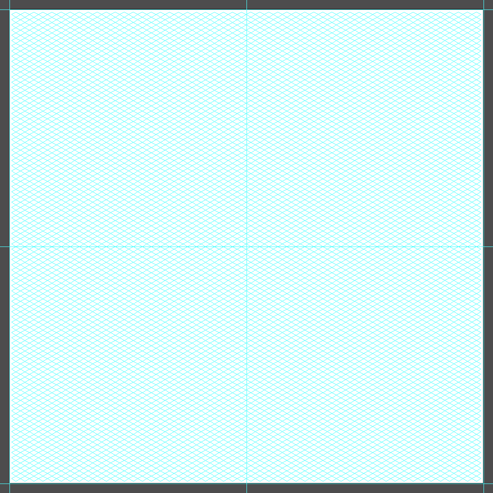
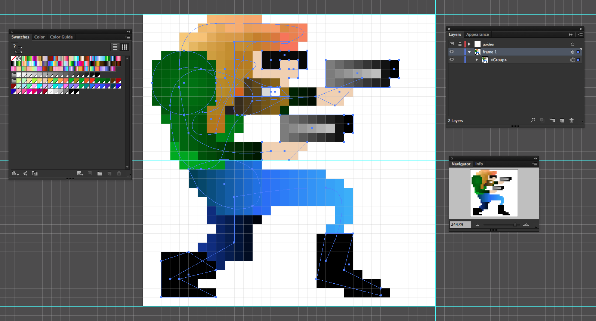
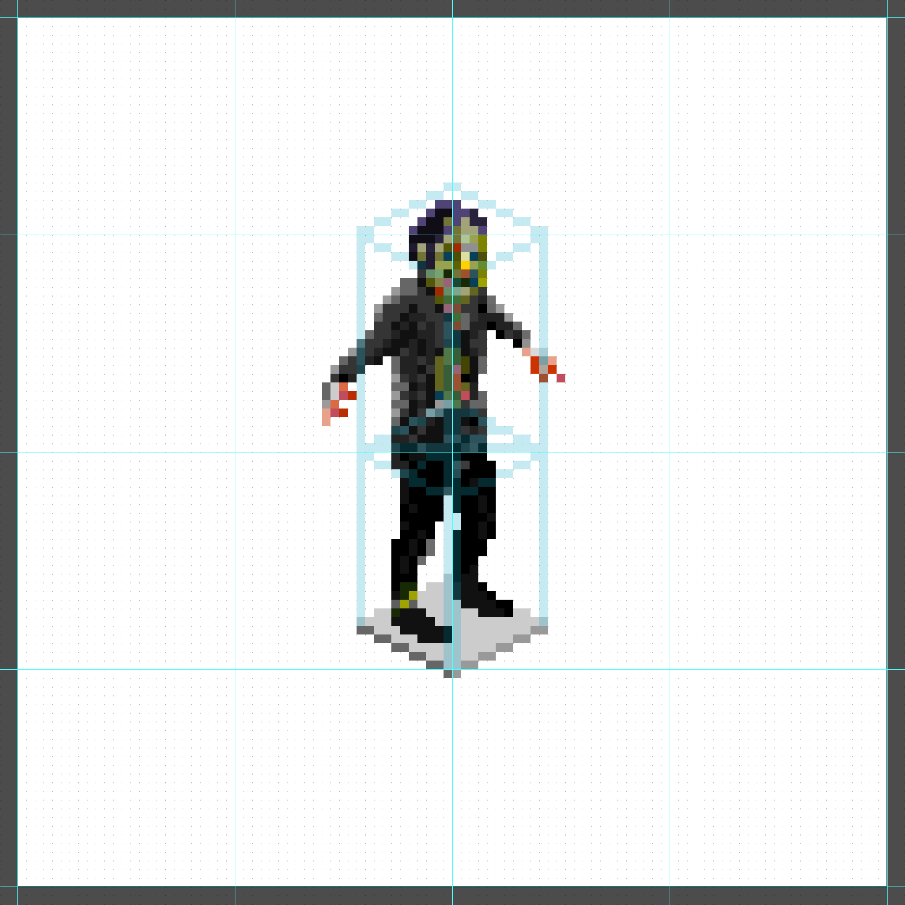

# Pixel

Templates setup specifically for pixel art, but could be used for pure vector illustrations.

## Template: `iso.ait`

Used to create isometric (30º angles) pixel art.

**Recommended preference:**

Or using [VectorScribe](http://www.astutegraphics.com/software/vectorscribe/)’s “protractor” panel:

## Template: `32x32.ait`

## Template: `paint.ait`

1. So far, the best approach is to use the ["Live Paint Bucket" tool](http://www.sketchypictures.com/1511/creating-pixel-art-in-illustrator/).

1. Make a canvas that's evenly divisible by the desired grid size. For example, 16px X 16px grids fits nicely on a 1600px X 1600px canvas.

1. You can use the grid tool, but I've found it more precise to create a rectangle (the size of your canvas) and then use the Object >> Path >> Split into Grid tool:

 

 For some reason, this gives me a precise grid (i.e., the lines match the document grid).

 Once you have a grid, select: Object >> Live Paint >> Make

 **IMPORTANT:** Get rid of the stroke on the rectangle as early as possible. I think I've noticed oddness when making a Live Paint object when the grid had a stroke.

1. **If all goes well, you should be able to turn on and off "Pixel Preview" without any aliasing of painted grid elements (example of vectors with "Pixel Preview" on):**

 

1. If everything is setup correctly, your document grid, live paint grid and document guides should line up precisely:

 

1. My prefs:

