# Swatches

Various swatch collections.

## `sega-master-system.ase`

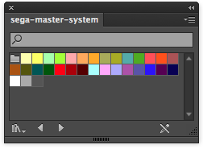

## `game-boy.ase`

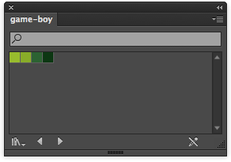

## `nes.ase`

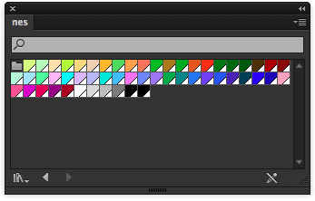

## `nes-gradients.ai`

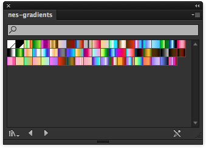

## `web2.ase`

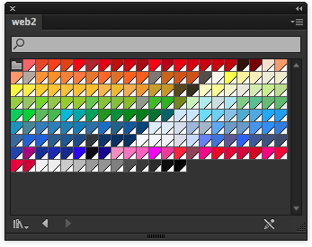

## `web2-gradients.ase`

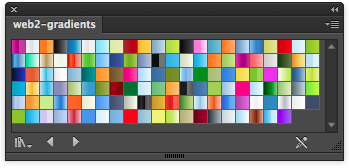

## `skin.ase`

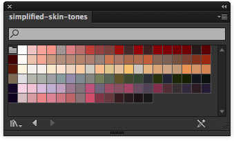

## `metal-gradients.ase`

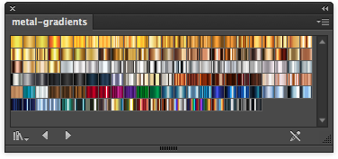

## `fun.ase`

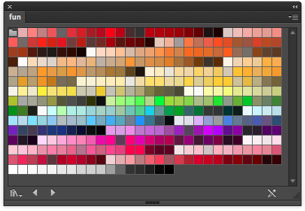

## `zx-spectrum.ase`

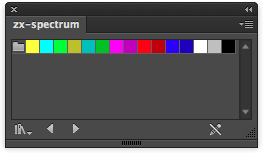

## `vic-20.ase`

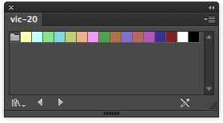

## `thomson-mo5.ase`

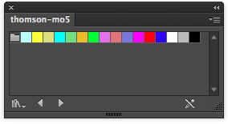

## `tele-text.ase`

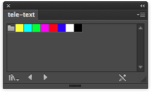

## `msx2.ase`

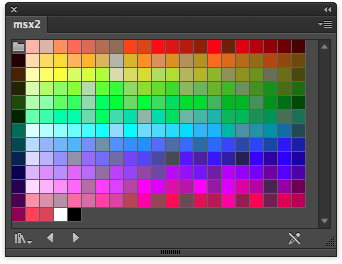

## `msx.ase`

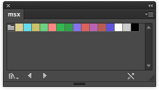

## `mega-drive.ase`

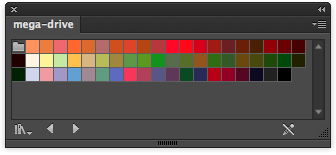

## `mattel-aquarius.ase`

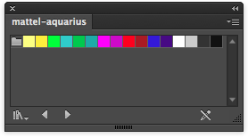

## `master-system.ase`

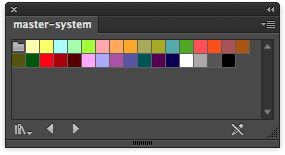

## `intellivision.ase`

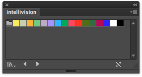

## `game-boy-color.ase`

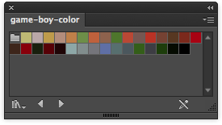

## `famicom.ase`

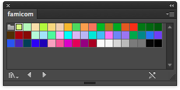

## `enhanced-graphics-adapter.ase`

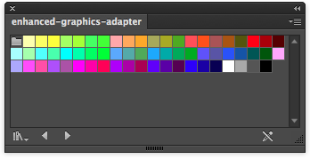

## `commodore-vic-20.ase`

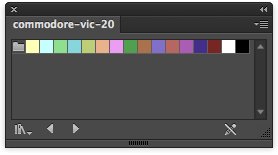

## `commodore-plus4.ase`

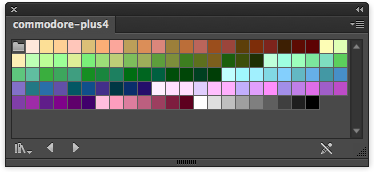

## `commodore-64.ase`

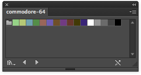

## `color-graphics-adapter.ase`

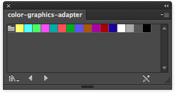

## `colecovision.ase`

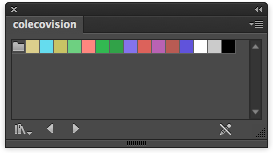

## `bbc-micro.ase`

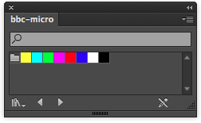

## `atari-2600.ase`

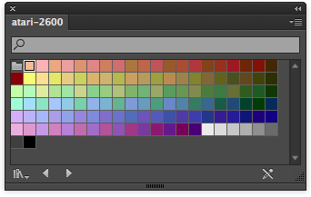

## `apple-ii.ase`

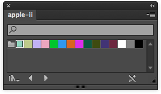

## `amstrad-cpc.ase`

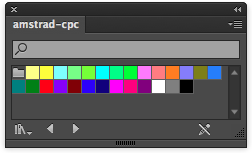

## `amiga.ase`

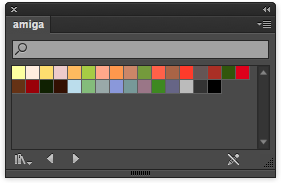

## `grayscale.ase`

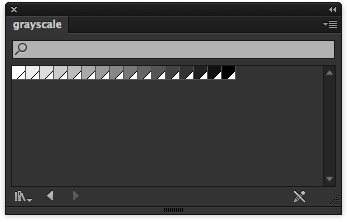

## `grayscale-expanded.ase`

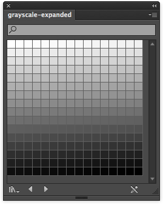

## `seperator.ase`

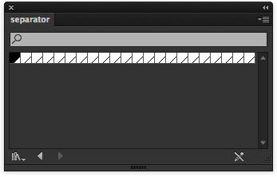

## `default.ase`

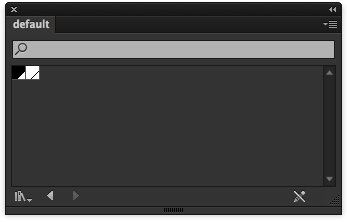
